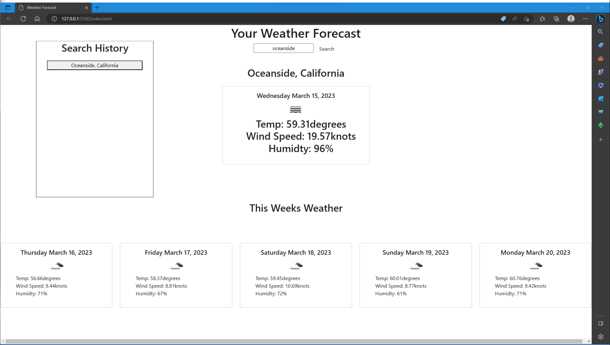

# Weather-Forecasting

## Description

This website allows users to search for the current weather as well as the next 5 days weathe forcast in a city of their choice. The cities that are searched are immedietly saved under the search history list for future reference. 

## Directions

- User can search a city in the search box. When the user inputs a city, press the search button.

- The current weather of the city will be presented under the search bar. Under the current weather will be a 5 day forecast of the chosen city.

- User can also press the buttons of previous searches on the left side to re-render previously searched cities.

## Live link
https://xyiorgyx.github.io/Weather-Forecasting/

## Github link
https://github.com/xyiorgyx/Weather-Forecasting

## Pictures
